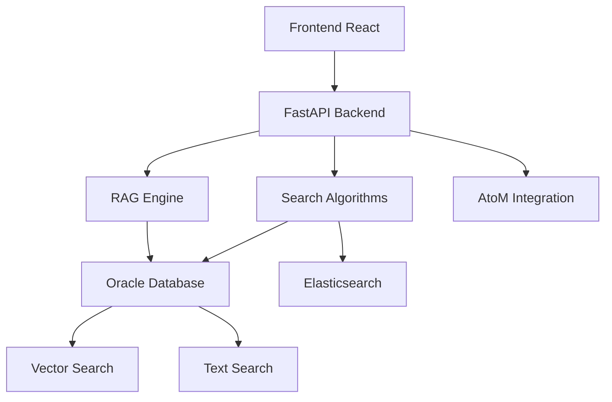

# 🤖 SIAN - Backend Python

Sistema Inteligente de Arquivos Nacionais com RAG (Retrieval-Augmented Generation) e múltiplos algoritmos de busca para consultas arquivísticas e documentais.

## 📋 Índice

- [Visão Geral](#-visão-geral)
- [Arquitetura](#-arquitetura)
- [Algoritmos de Busca](#-algoritmos-de-busca)
- [Instalação](#-instalação)
- [Configuração](#-configuração)
- [Uso](#-uso)
- [API Endpoints](#-api-endpoints)
- [Estrutura do Projeto](#-estrutura-do-projeto)
- [Desenvolvimento](#-desenvolvimento)

## 🎯 Visão Geral

O **SIAN (Sistema Inteligente de Arquivos Nacionais)** é um sistema avançado de recuperação de informações arquivísticas que combina:

- **RAG (Retrieval-Augmented Generation)**: Busca contextual em documentos arquivísticos
- **Múltiplos Algoritmos de Busca**: 6 diferentes estratégias de busca implementadas
- **Busca Semântica**: Utilizando embeddings vetoriais no Oracle Database
- **API RESTful**: Interface FastAPI para integração com frontend React
- **Suporte ao Português**: Otimizado para documentos arquivísticos brasileiros
- **Integração AtoM**: Conectado ao sistema Access to Memory

## 🏗️ Arquitetura



### Componentes Principais

- **FastAPI Application**: Servidor web principal (`main.py`)
- **RAG Models**: Modelos flash e thinking para diferentes tipos de consulta
- **Search Algorithms**: Múltiplos algoritmos de busca implementados
- **Vector Search**: Busca semântica com embeddings
- **Oracle Database**: Armazenamento principal de documentos arquivísticos
- **Elasticsearch**: Índice de busca textual avançada
- **AtoM Integration**: Conexão com sistema Access to Memory

## 🔍 Algoritmos de Busca

### 1. **BM25 Clássico** (`bm25_search.py`)
- Algoritmo probabilístico padrão-ouro para busca textual
- Considera frequência de termos e normalização por tamanho do documento
- Ideal para consultas com palavras-chave específicas

### 2. **BM25 com Proximidade** (`bm25p_search.py`)
- Extensão do BM25 que considera proximidade entre termos
- Favorece documentos onde termos da consulta aparecem próximos
- Melhor para consultas com múltiplas palavras relacionadas

### 3. **LambdaMART** (`lambdamart_search.py`)
- Re-ranking baseado em machine learning
- Combina múltiplas features: BM25, TF-IDF, tamanho do documento
- Aprendizado de ranking para melhor ordenação

### 4. **Elasticsearch** (`elasticsearch_search.py`)
- Busca profissional com índices invertidos
- Fuzzy matching automático e boosting de campos
- Escalável para grandes volumes de dados

### 5. **TF-IDF** (`tfidf_search.py`)
- Similaridade cosseno com vetores TF-IDF
- Boa para análise de similaridade de documentos
- Complementa outros algoritmos

### 6. **LIKE Simples** (`simple_like_search.py`)
- Busca básica com SQL LIKE
- Fallback para casos simples
- Rápida para consultas diretas

## 🚀 Instalação

### Pré-requisitos

- Python 3.8+
- Oracle Database (19c ou superior)
- Oracle Instant Client
- Elasticsearch 8.x
- Docker (opcional, para Elasticsearch)
- Chave API do Google Gemini

### 1. Clone o Repositório

```bash
git clone <repository-url>
cd chatbot/python-backend-2
```

### 2. Instale Dependências

```bash
pip install -r requirements.txt
```

### 3. Configure Oracle Instant Client

Baixe e configure o Oracle Instant Client:
- Descompacte em `C:\oracle\instantclient_23_9`
- Adicione ao PATH do sistema

### 4. Configure Elasticsearch (Opcional)

```bash
# Inicia Elasticsearch e Kibana
docker-compose -f docker-compose.elasticsearch.yml up -d

# Migra dados do Oracle para Elasticsearch
python migrate_to_elasticsearch.py
```

## ⚙️ Configuração

### 1. Variáveis de Ambiente

Crie um arquivo `.env` na raiz do projeto:

```env
# Configuração do Banco Oracle
DB_USER=seu_usuario
DB_PASSWORD=sua_senha
DB_DSN=localhost:1521/FREEPDB1

# URLs dos Serviços
URL_ATOM=http://localhost:63001
URL_FRONTEND=http://localhost:3000

# Configuração da API
GEMINI_API_KEY=sua_chave_gemini
```

### 2. Configuração do Banco

Certifique-se de que o Oracle Database está rodando e acessível:

```sql
-- Teste de conexão
SELECT 1 FROM dual;

-- Verificar tabelas do AtoM
SELECT COUNT(*) FROM information_object;
SELECT COUNT(*) FROM information_object_i18n;
```

## 🎮 Uso

### Iniciar o Servidor

```bash
# Desenvolvimento
python main.py

# Produção
uvicorn main:app --host 0.0.0.0 --port 7860
```

### Testar Algoritmos de Busca

```bash
# Testa todos os algoritmos
python text_search.py

# Testa busca vetorial
python vector_search.py

# Testa algoritmo específico
python search_algorithms/bm25_search.py
```

### Logs de Resultados

Os resultados dos testes são salvos em:
- `search_algorithms/bm25_results.txt`
- `search_algorithms/bm25p_results.txt`
- `search_algorithms/elasticsearch_results.txt`
- E outros...

## 🌐 API Endpoints

### Busca de Documentos

```http
POST /api/search
Content-Type: application/json

{
  "query": "questão de limites entre Ceará e Piauí",
  "n_results": 5
}
```

### Resposta

```json
{
  "documents": [
    {
      "text": "Conteúdo do documento...",
      "url": "https://exemplo.com/documento",
      "title": "Título do documento",
      "relevance_score": 8.5
    }
  ]
}
```

### Chat RAG

```http
POST /api/chat
Content-Type: application/json

{
  "message": "Qual foi a questão de limites entre Ceará e Piauí?",
  "conversation_id": "uuid-opcional"
}
```

## 📁 Estrutura do Projeto

```
python-backend-2/
├── 📁 api/                     # API FastAPI
│   ├── __init__.py
│   ├── api_service.py          # Lógica de negócio da API
│   ├── models.py               # Modelos Pydantic
│   └── routers.py              # Rotas da API
├── 📁 rag_models/              # Modelos RAG
│   ├── flash/                  # Modelo rápido
│   │   ├── config.py           # Configurações do modelo
│   │   ├── messages.py         # Mensagens de progresso
│   │   ├── pipeline.py         # Pipeline de processamento
│   │   ├── query_engine.py     # Engine de consultas
│   │   └── utils.py            # Utilitários
│   └── thinking/               # Modelo avançado
│       ├── config.py           # Configurações do modelo
│       ├── messages.py         # Mensagens de progresso
│       ├── pipeline.py         # Pipeline de processamento
│       ├── query_engine.py     # Engine de consultas
│       └── validation.py       # Validação de entrada
├── 📁 search_algorithms/       # Algoritmos de busca
│   ├── bm25_search.py          # BM25 clássico
│   ├── bm25p_search.py         # BM25 com proximidade
│   ├── lambdamart_search.py    # LambdaMART re-ranking
│   ├── elasticsearch_search.py # Elasticsearch
│   ├── tfidf_search.py         # TF-IDF
│   ├── simple_like_search.py   # LIKE simples
│   └── *_results.txt           # Logs de resultados
├── config.py                   # Configuração da aplicação
├── main.py                     # Ponto de entrada FastAPI
├── text_search.py              # Interface principal de busca
├── vector_search.py            # Busca semântica vetorial
├── migrate_to_elasticsearch.py # Migração para Elasticsearch
├── docker-compose.elasticsearch.yml # Docker Compose ES
├── requirements.txt            # Dependências Python
└── README.md                   # Esta documentação
```

## 🛠️ Desenvolvimento

### Adicionar Novo Algoritmo

1. Crie arquivo em `search_algorithms/novo_algoritmo_search.py`
2. Implemente função `search_documents_by_text(queries, n_results_per_query)`
3. Adicione ao dicionário em `text_search.py`
4. Teste com `python text_search.py`

### Estrutura do Algoritmo

```python
def search_documents_by_text(queries, n_results_per_query=5):
    """Implementação do algoritmo de busca
    
    Args:
        queries (list[str]): Lista de consultas
        n_results_per_query (int): Resultados por consulta
        
    Returns:
        list[dict]: Documentos com 'text', 'url', 'title', 'relevance_score'
    """
    # Sua implementação aqui
    pass
```

### Executar Testes

```bash
# Testa todos os algoritmos e salva logs
python text_search.py

# Testa busca vetorial
python vector_search.py

# Inicia servidor de desenvolvimento
python main.py
```

### Monitoramento

- **Logs**: Configurados via `logging` do Python
- **Métricas**: Elasticsearch (se configurado)
- **Saúde**: Endpoint `/health` (se implementado)

## 📊 Performance

### Benchmarks Típicos

| Algoritmo | Tempo Médio | Precisão | Recall |
|-----------|-------------|----------|--------|
| BM25 | ~100ms | Alta | Média |
| BM25P | ~150ms | Alta | Alta |
| Elasticsearch | ~50ms | Alta | Alta |
| Vector Search | ~200ms | Muito Alta | Alta |

### Otimizações

- **Cache de Modelos**: Embeddings carregados uma vez
- **Pool de Conexões**: Oracle connection pooling
- **Índices**: Otimizados para cada algoritmo
- **Batch Processing**: Múltiplas consultas em lote

## 🤝 Contribuição

1. Fork o projeto
2. Crie branch para feature (`git checkout -b feature/nova-funcionalidade`)
3. Commit suas mudanças (`git commit -am 'Adiciona nova funcionalidade'`)
4. Push para branch (`git push origin feature/nova-funcionalidade`)
5. Abra Pull Request


---

**SIAN** • *Sistema Inteligente de Arquivos Nacionais* • Dataprev © 2025

**Desenvolvido com ❤️ para democratizar o acesso à informação arquivística brasileira**